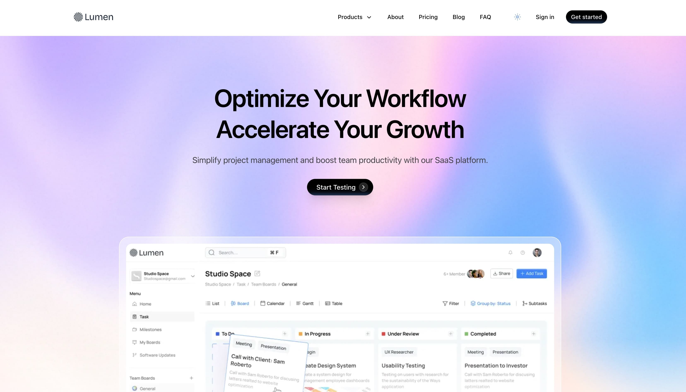

# Lumen Astro Template

Lumen Astro Template is a premium template built by https://www.shadcnblocks.com

- [Demo](https://lumen-astro-template.vercel.app/)
- [Documentation](https://www.shadcnblocks.com/docs/templates/getting-started)

## Screenshot



## Getting Started

```bash
# Install dependencies
npm install

# Run the development server
npm run dev
```

Open [http://localhost:4321](http://localhost:4321) with your browser to see the result.

## Tech Stack

- Astro 6.x
- Tailwind 4
- shadcn/ui

## Deploy

You can deploy this template to your preferred hosting platform that supports Astro applications.

We have tested this template with the following providers using static export.

- [Netlify](https://netlify.com)
- [Vercel](https://vercel.com)
- [Cloudflare Pages](https://pages.cloudflare.com)
